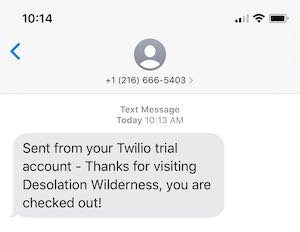
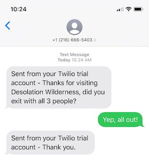
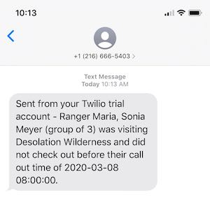
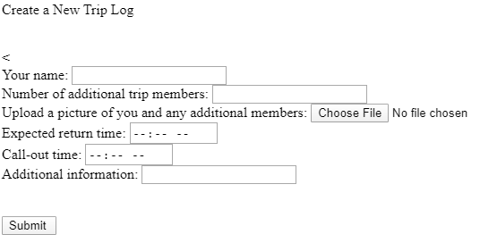

## Inspiration
As one of the few female cave explorers of the deepest caves in the world, team member Sonia immediately brought in the topic of outdoor safety as a potential project she was passionate about. Several recent cave rescues made international and domestic news ⁠— the Thai cave rescue last year, the Indiana student trapped in a cave for 3 days, and the couple who burned their clothes to stay warm after losing their way in a cave ⁠— also sparked passion to do something about these situations. 

Looking into the issue of fatalities in outdoor recreation, we found that on average, approximately 160 visitors per year die in America’s national parks every year, as reported by the National Park Service. Between 2015-2016, the NPS also reported 5,395 SAR (search and rescue) incidents. Across the globe, areas like the Diamond Bay Reserve in Australia or Mount Blanc in France are reported as some of the deadliest attractions for outdoor patrons, claiming multiple fatalities and injuries throughout the years.

By streamlining search and rescue responses, Limestone would prevent thousands of such tragedies and greatly improve public safety. In addition, issues such as resource management and visitor impacts, especially critical in regions like California where trails are frequently crowded and beautiful land becomes damaged after visitor use, would benefit. Public and private land managers would be able to monitor visitor use through the trip logs and use the data to better manage resources that go into maintaining the land.

## What it does
Limestone is an embedded system programmer in Python on a Raspberry Pi for land managers to deploy at trailheads and cave entrances. Visitors can connect via bluetooth and enter a digital entry/exit log. If a visitor does not check out, it will go through a system of automatic responses.

The user connects to Limestone via our Android app. The user is prompted to add a trip with important information like:
* Name, Phone
* Group Size
* Expected Out Time
* Call Out Time
Call out time is the time to initiate a rescue and should be liberal to account for unexpected delays. Ex: expected out is 8 PM, call out is 8 AM the next day.

Scenarios:

Visitor exits around expected time and checks out
* Great! Twilio will send a text confirming check out

Visitor exits around expected time, forgets to check out
* Twilio will send a text at a time between expected out and call out time determined by an algorithm
* If the visitor responds to the text, they are checked out
* Twilio will send a text confirming check out

Visitor exits after expected time, but before call out time
* Twilio will send a text at a time between expected out and call out time determined by an algorithm
* Visitor exits after expected time and checks out
* Twilio will send a text confirming check out

Visitor does not exit before call out time
* Twilio will notify the land manager to initiate a rescue response with the visitor’s name, location entered, and group size

## How I built it
How we built it: Given the brevity of the hackathon, we made this assumptions to narrow the scope of our work--that we have a weatherized Raspberry Pi connected to data where battery and storage was not an issue. We broke the project into three parts and each team member chose a part they were most comfortable with based on their skills:
1. Front end - Android app (Madison)
2. Database and data transfer (Lucy)
3. Back end - Python and Twilio (Sonia)

Madison - Madison worked on the front end Android app and interface.

Lucy - Lucy interfaced the front end and back end by having the app write to a csv file for the back end to interact with.

Sonia - When a change is observed in the csv, it checks if a new row was added. If so, it will initiate the check_in.py code, which sets various timers using datetime and threader modules to check the visitor status and if not checked out, to enact the various scenarios described above. I wrote an algorithm to determine what time to initiate contact between the expected out and call out times. The check_in.py file calls Twilio functions from another file. I created a Flask app to allow the user to text back to our server and that response will update their status in the csv file.

 

Above shows a very rough outline of a page and will be styled and designed in the future when needed. This is a sample of the form the user fills out before they go on their trip.
